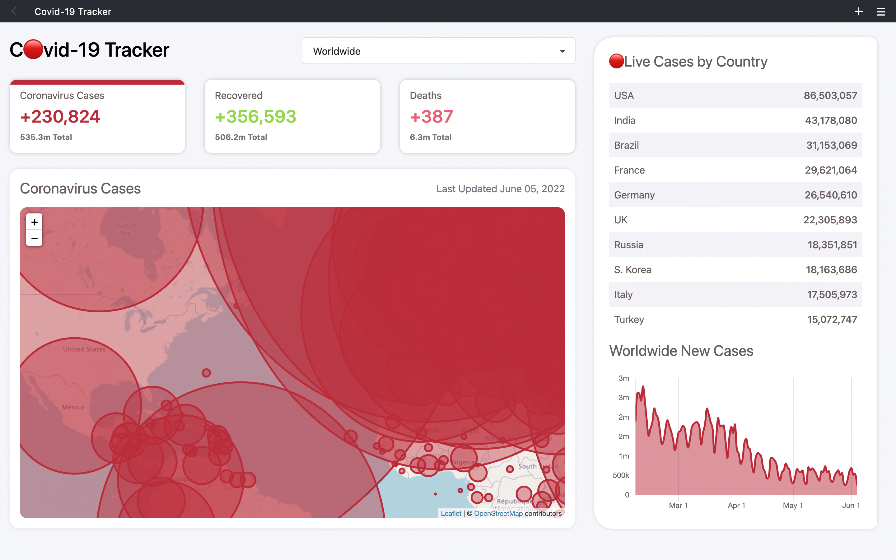
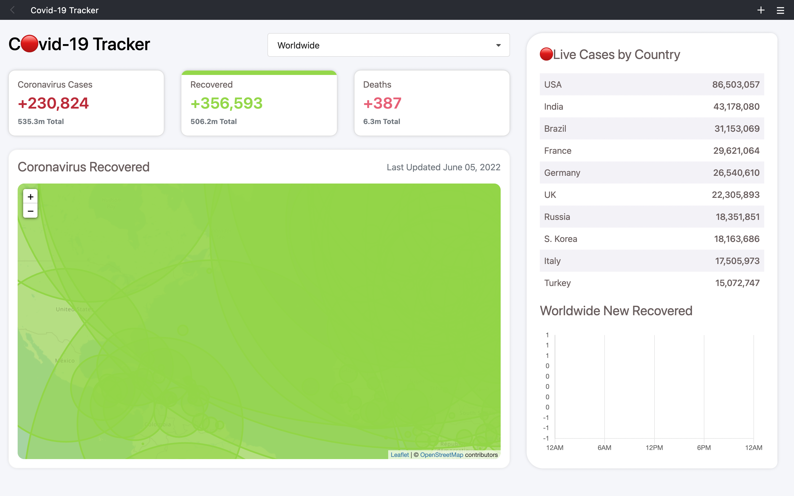
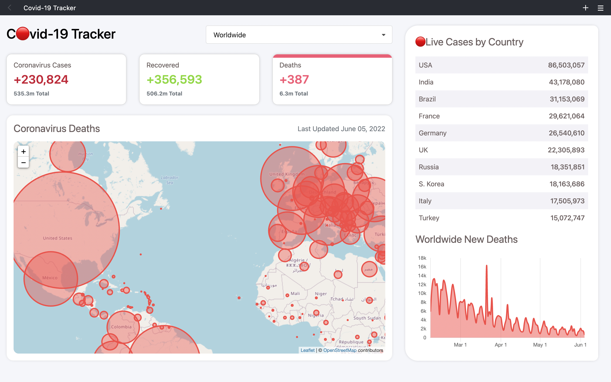
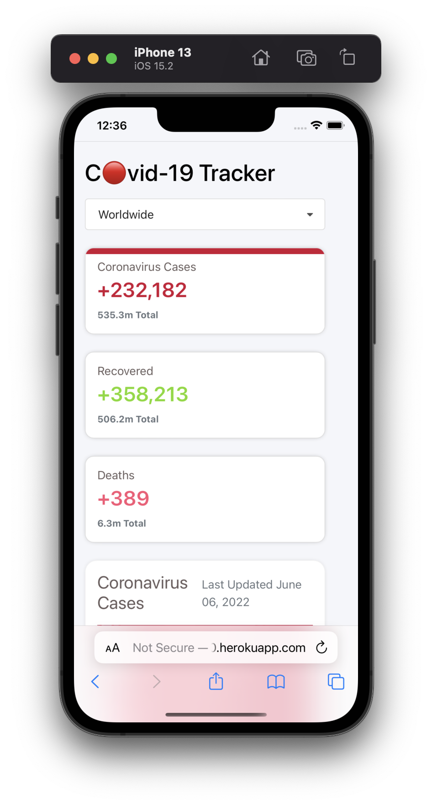
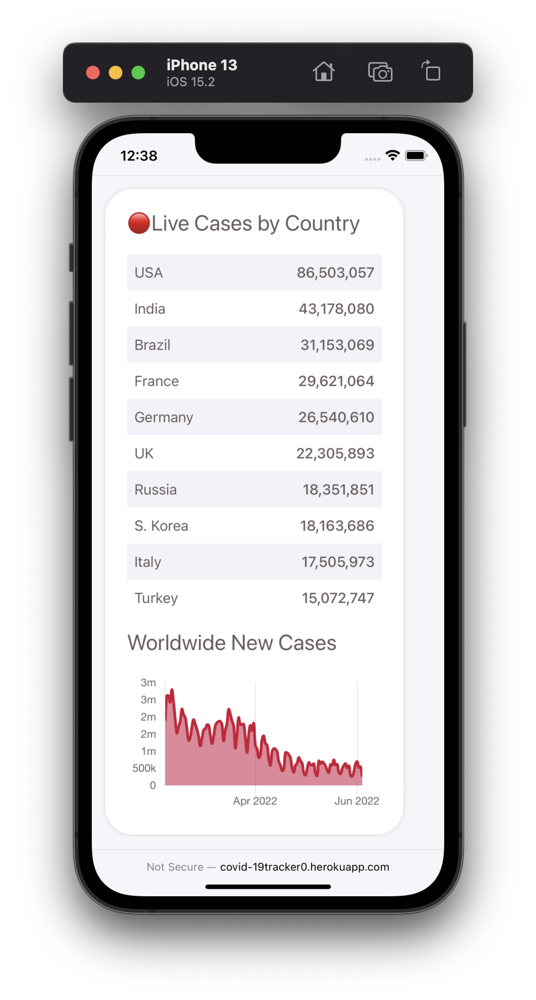

[](https://covid-19tracker0.herokuapp.com)
[](https://covid-19tracker0.herokuapp.com)
[](https://covid-19tracker0.herokuapp.com)

## Covid-19 Tracker Application using disease.sh - Open Disease Data API

<div>

<div align="center">
    
    <h6>Move with Safety</h5>
        Logo made using <a href='https://www.figma.com/'>Figma</a>

<div>
<div>

## 🧑🏻‍💻 Story

### The goal of this project is to create a web application that will allow users to track the number of cases, recoveries, and deaths of a specific disease. The application will allow users to search country by name, and then view the number of cases, recoveries, and deaths for that country.

## 📱 Snapshot

<p>
    
    
    
</p>

<div align="left">

## Stack

- [JavaScript](https://developer.mozilla.org/en-US/docs/Web/JavaScript)
- [Python](https://www.python.org/downloads/)
- [CSS](https://developer.mozilla.org/en-US/docs/Web/CSS)
- [Django](https://www.djangoproject.com/)
- [Heroku](https://www.heroku.com)

## Files-Structure

```
$PROJECT_ROOT
├── LICENSE
├── Pipfile.lock
├── Procfile
├── README.md
├── admin.py
├── apps.py
├── assets
│   └── snapshot.png
├── backend
│   ├── settings.py
│   ├── urls.py
│   └── wsgi.py
├── covid
│   ├── admin.py
│   ├── apps.py
│   └── migrations
│       └── 0001_initial.py
├── manage.py
├── migrations
│   └── 0001_initial.py
├── models.py
├── requirements.txt
├── static
│   ├── css
│   │   ├── mobile.css
│   │   ├── new-style.css
│   │   └── style.css
│   └── js
│       ├── charts.js
│       ├── map-style.js
│       └── script.js
├── templates
│   └── index.html
├── tests.py
├── urls.py
└── views.py
```
