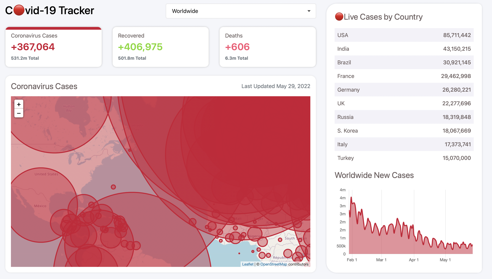

# Covid-19Tracker

[](https://covid-19tracker0.herokuapp.com)

## Stack

- [JavaScript](https://developer.mozilla.org/en-US/docs/Web/JavaScript) - JavaScript (JS) is a lightweight, interpreted, or just-in-time compiled programming language with first-class functions.
- [Python](https://www.python.org/downloads/) - Python is a high-level, interpreted, general-purpose programming language.
- [CSS](https://developer.mozilla.org/en-US/docs/Web/CSS) - Cascading Style Sheets is a style sheet language used for describing the presentation of a document written in a markup language.
- [Django](https://www.djangoproject.com/) - Django is a Python-based web framework, free and open-source, that follows the model–template–views architectural pattern.

## Files-Structure

```
$PROJECT_ROOT
├── LICENSE
├── Pipfile.lock
├── Procfile
├── README.md
├── admin.py
├── apps.py
├── assets
│   └── snapshot.png
├── backend
│   ├── settings.py
│   ├── urls.py
│   └── wsgi.py
├── covid
│   ├── admin.py
│   ├── apps.py
│   └── migrations
│       └── 0001_initial.py
├── manage.py
├── migrations
│   └── 0001_initial.py
├── models.py
├── requirements.txt
├── static
│   ├── css
│   │   ├── mobile.css
│   │   ├── new-style.css
│   │   └── style.css
│   └── js
│       ├── charts.js
│       ├── map-style.js
│       └── script.js
├── templates
│   └── index.html
├── tests.py
├── urls.py
└── views.py
```
